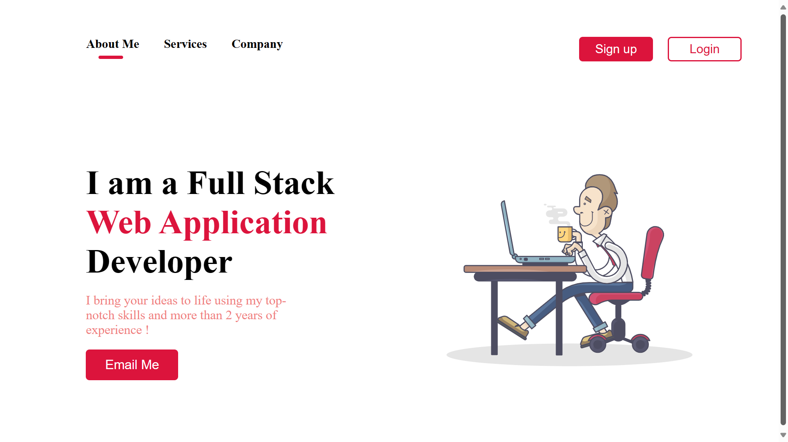

# Portfolio-Webpage

## Overview
This is a simple portfolio webpage designed to highlight work, skills, and contact information.

## Project URL
Check out the live version of the project here: [Portfolio-Webpage](https://portfolio-webpage-website.netlify.app/)

## Screenshots
Here are some screenshots of the project:

## Technologies Used
- **HTML**
- **CSS**

## Installation and Setup
To run this project locally, follow these steps:
1. Clone the repository: `git clone https://github.com/Developer-Bilal/Portfolio-Webpage.git`
2. Navigate to the project directory: `cd Portfolio-Webpage`
3. Open the HTML file in your preferred browser.

## Contact
If you have any questions or suggestions, feel free to contact me at developer.bilal.channa@gmail.com.

